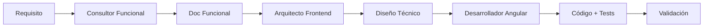

# Agentes PadelMixer

Este directorio contiene las definiciones de agentes especializados para el proyecto PadelMixer. Cada agente tiene un rol específico y traba ja con su propio conjunto de directrices y metodologías.

## Agentes Disponibles

### 1. Consultor Funcional Experto en Pádel

**Archivo:** `consultor-funcional-experto-padel.md`

**Rol:** Consultor funcional senior especializado en pádel y análisis de producto digital.

**Responsabilidades:**
- Inventariar y documentar funcionalidades existentes del portal
- Describir funcionalidades desde una perspectiva de negocio
- Identificar funcionalidades ausentes o no implementadas
- Proporcionar recomendaciones basadas en evidencia del repositorio

**Características clave:**
- ✅ Análisis basado en evidencia del código
- ✅ Distinción clara entre funcionalidades existentes y ausentes
- ✅ Documentación orientada a negocio con respaldo técnico
- ✅ Identificación de gaps funcionales

**Formato de salida:**
- Resumen ejecutivo
- Mapa del portal
- Inventario detallado de funcionalidades
- Lista de funcionalidades ausentes
- Recomendaciones priorizadas

---

### 2. Arquitecto Frontend Angular - Especialista en Web Components

**Archivo:** `arquitecto-frontend-angular-webcomponents.md`

**Rol:** Arquitecto frontend senior especializado en Angular y diseño basado en Web Components.

**Responsabilidades:**
- Diseñar arquitecturas de componentes modulares y escalables
- Definir jerarquías de componentes y patrones de comunicación
- Establecer estándares de código y mejores prácticas
- Documentar diseños con diagramas y especificaciones detalladas

**Filosofía:** _"Todo es un componente web"_ - Las funcionalidades se diseñan como componentes web reutilizables que se componen dentro de otros componentes.

**Principios arquitectónicos:**
- 🧩 Componentización radical (Atomic Design)
- 🔄 Composición sobre herencia
- 📦 Encapsulación y autocontención
- ♻️ Máxima reutilización (DRY)
- 🎯 Smart vs Presentational Components
- 🚀 Standalone Components (Angular 14+)

**Formato de salida:**
- Resumen funcional
- Diagramas Mermaid de arquitectura
- Tabla de componentes con responsabilidades
- Detalle de cada componente (inputs, outputs, estado)
- Flujo de datos
- Plan de implementación
- Estrategia de testing

**Estructura de componentes propuesta:**
```
src/app/
├── core/              # Servicios singleton, guards, interceptors
├── shared/            # Componentes reutilizables
│   └── components/
│       ├── atoms/     # Componentes básicos
│       ├── molecules/ # Composición de átomos
│       └── organisms/ # Composición compleja
├── features/          # Módulos por dominio funcional
├── layouts/           # Layouts de aplicación
└── app.component.ts
```

---

### 3. Desarrollador Angular Senior - Implementador de Componentes Web

**Archivo:** `desarrollador-angular-senior.md`

**Rol:** Desarrollador senior especializado en implementación de aplicaciones Angular basadas en diseños técnicos.

**Responsabilidades:**
- Transformar diseños técnicos en código funcional
- Implementar componentes siguiendo especificaciones del Arquitecto
- Escribir tests unitarios y de integración
- Aplicar mejores prácticas de desarrollo Angular
- Documentar código con JSDoc
- Garantizar calidad y mantenibilidad del código

**Filosofía:** _"El código es para humanos, no para máquinas"_ - Escribir código claro, mantenible y bien testeado que otros desarrolladores puedan entender fácilmente.

**Principios de desarrollo:**
- 📋 Especificación primero (seguir diseño técnico fielmente)
- ✨ Calidad sobre rapidez
- 🔄 DRY (Don't Repeat Yourself)
- 🎯 SOLID principles
- 💪 TypeScript estricto (sin `any`)
- 🧪 Testing exhaustivo (>80% cobertura)

**Stack técnico:**
- Angular 17+ (Standalone Components, Signals API)
- TypeScript (strict mode)
- RxJS para programación reactiva
- Jasmine/Karma para testing
- CSS3 con BEM methodology

**Orden de implementación:**
1. Core (Modelos, Interfaces, Tipos)
2. Core Services (API, Auth, Config)
3. Shared Components (Atoms → Molecules → Organisms)
4. Layouts
5. Feature Components & Services
6. Routing Configuration
7. Guards & Interceptors
8. Tests

**Entregables:**
- Código fuente completo
- Tests unitarios (>80% cobertura)
- Documentación JSDoc
- README de features
- Estructura de directorios completa

**Métricas de calidad:**
- Cobertura de tests: > 80%
- Complejidad ciclomática: < 10 por método
- Duplicación de código: < 3%
- Líneas por componente: < 300
- Lighthouse score: > 90

---

## Uso de los Agentes

### Cómo usar un agente

1. **Abre el archivo del agente** que necesites en VSCode
2. **Lee las instrucciones** y contexto del agente
3. **Interactúa según el rol** del agente:
   - Para análisis funcional → usa el Consultor Funcional
   - Para diseño de componentes → usa el Arquitecto Frontend
   - Para implementación de código → usa el Desarrollador Angular

### Flujo de trabajo recomendado



### Ejemplo de colaboración entre agentes

1. **Paso 1 - Análisis Funcional:**
   - Usar el **Consultor Funcional** para documentar qué funcionalidad se necesita
   - Obtener casos de uso, reglas de negocio, y evidencia del código actual
   - **Output:** Documento funcional en `doc/funcional/`

2. **Paso 2 - Diseño Técnico:**
   - Usar el **Arquitecto Frontend** con el documento funcional del paso 1
   - Obtener arquitectura de componentes, jerarquías, y plan de implementación
   - **Output:** Diseño técnico en `doc/disenyo-tecnico/`

3. **Paso 3 - Implementación:**
   - Usar el **Desarrollador Angular** con el diseño técnico del paso 2
   - Implementar componentes, servicios, guards según especificaciones
   - Escribir tests unitarios (>80% cobertura)
   - **Output:** Código fuente en `src/app/`

4. **Paso 4 - Validación:**
   - Usar el **Consultor Funcional** para verificar que se cumplan los requisitos
   - Validar que la implementación satisface los casos de uso documentados

---

## Convenciones de Documentación

Todos los agentes siguen estas convenciones:

### Estructura de archivo de agente

```markdown
# Agente: [Nombre del Agente]

## Rol
[Descripción del rol]

## Misión
[Lista de responsabilidades]

## Reglas de trabajo
[Principios no negociables]

## Procedimiento recomendado
[Metodología paso a paso]

## Formato de salida
[Plantillas y ejemplos]

## Estilo de comunicación
[Tono y formato preferido]
```

### Estándares comunes

- **Idioma:** Español (España)
- **Formato:** Markdown con sintaxis GitHub Flavored
- **Diagramas:** Mermaid cuando sea apropiado
- **Código:** Bloques de código con syntax highlighting
- **Ejemplos:** Siempre que ayuden a clarificar

---

## Crear un Nuevo Agente

Si necesitas crear un nuevo agente especializado:

1. **Crea un archivo** en este directorio: `nombre-del-agente.md`
2. **Sigue la estructura** estándar mostrada arriba
3. **Define claramente:**
   - Rol y responsabilidades
   - Reglas de trabajo (no negociables)
   - Metodología y procedimientos
   - Formato de salida esperado
   - Estilo de comunicación
4. **Documenta el agente** en este README
5. **Incluye ejemplos** de casos de uso

---

## Recursos Adicionales

- **Documentación Angular:** [angular.dev](https://angular.dev)
- **TypeScript Handbook:** [typescriptlang.org](https://www.typescriptlang.org/docs/)
- **Atomic Design:** [bradfrost.com](https://bradfrost.com/blog/post/atomic-web-design/)
- **WCAG Guidelines:** [w3.org/WAI/WCAG21](https://www.w3.org/WAI/WCAG21/quickref/)

---

## Mantenimiento

Este directorio es mantenido por el equipo de desarrollo de PadelMixer.

**Última actualización:** Enero 2026

Para contribuir o reportar issues, contacta al equipo de desarrollo.
