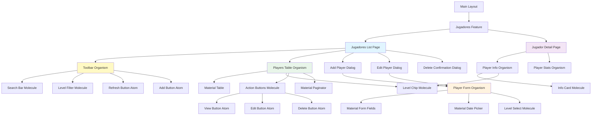

# Diseño Técnico: Gestión de Jugadores (PadelMixer)

**Versión**: 1.0  
**Fecha**: 16/01/2026  
**Estado**: Diseño Inicial  
**Proyecto**: PadelMixer  
**Arquitecto**: Arquitecto Frontend Angular - Especialista en Web Components  
**Basado en**: `doc/funcional/func-jugadores.md`

---

## Tabla de Contenidos

1. [Resumen Ejecutivo](#1-resumen-ejecutivo)
2. [Arquitectura de Componentes](#2-arquitectura-de-componentes)
3. [Estructura de Directorios](#3-estructura-de-directorios)
4. [Modelos de Datos](#4-modelos-de-datos)
5. [Servicios y Capa de Backend](#5-servicios-y-capa-de-backend)
6. [Mocks y Desarrollo](#6-mocks-y-desarrollo)
7. [Componentes Detallados](#7-componentes-detallados)
8. [Configuración de Rutas](#8-configuración-de-rutas)
9. [Guards y Seguridad](#9-guards-y-seguridad)
10. [Flujos de Usuario](#10-flujos-de-usuario)
11. [Estilos y Temas](#11-estilos-y-temas)
12. [Testing Strategy](#12-testing-strategy)
13. [Checklist de Implementación](#13-checklist-de-implementación)

---

## 1. Resumen Ejecutivo

### 1.1. Propósito del Documento
Este documento define la arquitectura técnica de la funcionalidad **Gestión de Jugadores** del portal PadelMixer, estableciendo la estructura completa de componentes, servicios, rutas y modelos de datos necesarios para implementar el sistema CRUD de jugadores.

### 1.2. Alcance del Diseño
- ✅ **F-JUG-01**: Listado de jugadores con tabla paginada, filtros y búsqueda
- ✅ **F-JUG-02**: Alta de nuevo jugador (solo administradores)
- ✅ **F-JUG-03**: Edición de jugador existente (solo administradores)
- ✅ **F-JUG-04**: Eliminación de jugador con validaciones (solo administradores)
- ✅ **F-JUG-05**: Vista de detalle de jugador (todos los usuarios)
- ✅ **Sistema de permisos**: Control de acceso basado en roles
- ✅ **Validaciones**: Formularios con validación en tiempo real
- ✅ **Datos mock**: Sistema completo de mocks para desarrollo independiente

### 1.3. Stack Tecnológico
- **Framework**: Angular 17+ (Standalone Components)
- **Lenguaje**: TypeScript 5+
- **UI Library**: Angular Material 17+
  - `mat-table` con paginación y ordenamiento
  - `mat-form-field` para formularios
  - `mat-dialog` para modales
  - `mat-chip` para niveles de juego
  - `mat-datepicker` para fechas
- **Estado**: Angular Signals API
- **Routing**: Angular Router con lazy loading
- **Formularios**: Reactive Forms con validación
- **HTTP**: HttpClient con interceptores
- **Testing**: Jasmine + Karma

### 1.4. Principios de Diseño Aplicados
1. **Atomic Design**: Organización jerárquica de componentes
2. **Smart/Presentational Pattern**: Separación clara de responsabilidades
3. **Role-Based Access Control (RBAC)**: Control de permisos por rol
4. **Reactive Forms**: Validación robusta y tipo-segura
5. **Mock-Driven Development**: Desarrollo independiente del backend
6. **Material Design First**: Uso prioritario de componentes Material

---

## 2. Arquitectura de Componentes

### 2.1. Diagrama de Arquitectura General



### 2.2. Jerarquía Atomic Design

#### **Atoms (Átomos)**
Componentes básicos de Angular Material:
- `mat-button` - Botones de acción
- `mat-icon` - Iconos Material
- `mat-form-field` - Campos de formulario
- `mat-input` - Inputs de texto
- `mat-chip` - Chips de nivel
- `mat-badge` - Badges numéricos

#### **Molecules (Moléculas)**
- `SearchBar` - Input de búsqueda
- `LevelFilter` - Filtro de niveles
- `LevelChip` - Chip estilizado por nivel
- `ActionButtons` - Grupo de botones de acción
- `InfoCard` - Tarjeta de información

#### **Organisms (Organismos)**
- `JugadoresToolbar` - Barra de herramientas completa
- `PlayersTable` - Tabla con datos y paginación
- `PlayerForm` - Formulario reactivo
- `PlayerInfo` - Información detallada

#### **Pages (Páginas)**
- `JugadoresListPage` - Listado principal
- `JugadorDetailPage` - Detalle del jugador

#### **Dialogs (Diálogos)**
- `AddPlayerDialog` - Modal de alta
- `EditPlayerDialog` - Modal de edición
- `DeleteConfirmDialog` - Confirmación de eliminación

### 2.3. Tabla Resumen de Componentes

| Componente | Tipo | Responsabilidad | Reutilizable | Ubicación |
|------------|------|-----------------|--------------|-----------|
| SearchBar | Molecule | Campo búsqueda | Sí | `shared/components/molecules/search-bar/` |
| LevelFilter | Molecule | Filtro niveles | Sí | `shared/components/molecules/level-filter/` |
| LevelChip | Molecule | Chip coloreado | Sí | `shared/components/molecules/level-chip/` |
| ActionButtons | Molecule | Botones acción | Sí | `shared/components/molecules/action-buttons/` |
| JugadoresToolbar | Organism | Barra herramientas | No | `features/jugadores/components/toolbar/` |
| PlayersTable | Organism | Tabla jugadores | No | `features/jugadores/components/players-table/` |
| PlayerForm | Organism | Formulario | No | `features/jugadores/components/player-form/` |
| PlayerInfo | Organism | Info detallada | No | `features/jugadores/components/player-info/` |
| AddPlayerDialog | Dialog | Modal alta | No | `features/jugadores/dialogs/add-player-dialog/` |
| EditPlayerDialog | Dialog | Modal edición | No | `features/jugadores/dialogs/edit-player-dialog/` |
| DeleteConfirmDialog | Dialog | Confirmación | No | `features/jugadores/dialogs/delete-confirm-dialog/` |
| JugadoresListPage | Page | Lista jugadores | No | `features/jugadores/pages/jugadores-list/` |
| JugadorDetailPage | Page | Detalle jugador | No | `features/jugadores/pages/jugador-detail/` |

---

## 3. Estructura de Directorios

```
src/app/
│
├── core/
│   ├── models/
│   │   └── jugador.model.ts                 # Interfaces de jugadores
│   │
│   ├── services/
│   │   └── jugadores.service.ts             # Servicio de gestión
│   │
│   └── mocks/
│       └── jugadores.mock.ts                # Datos mock
│
├── shared/
│   └── components/
│       └── molecules/
│           ├── search-bar/
│           ├── level-filter/
│           ├── level-chip/
│           └── action-buttons/
│
└── features/
    └── jugadores/
        ├── components/
        │   ├── toolbar/
        │   ├── players-table/
        │   ├── player-form/
        │   └── player-info/
        │
        ├── dialogs/
        │   ├── add-player-dialog/
        │   ├── edit-player-dialog/
        │   └── delete-confirm-dialog/
        │
        ├── pages/
        │   ├── jugadores-list/
        │   └── jugador-detail/
        │
        └── jugadores.routes.ts
```

---

## 4. Modelos de Datos

### 4.1. Interfaces TypeScript

**📁 Ubicación**: `src/app/core/models/jugador.model.ts`

```typescript
/**
 * Niveles de juego disponibles
 */
export type NivelJuego = 'INICIACION' | 'MEDIO' | 'AVANZADO' | 'PROFESIONAL';

/**
 * Entidad principal: Jugador
 */
export interface Jugador {
  id: number;
  nombre: string;
  apellidos: string;
  email: string;
  telefono?: string;
  fechaNacimiento: string; // ISO 8601: "YYYY-MM-DD"
  nivelJuego: NivelJuego;
  fechaAlta: string; // ISO 8601: "YYYY-MM-DDTHH:mm:ss"
  observaciones?: string;
  activo: boolean;
}

/**
 * Datos del formulario
 */
export interface JugadorFormData {
  nombre: string;
  apellidos: string;
  email: string;
  telefono?: string;
  fechaNacimiento: string;
  nivelJuego: NivelJuego;
  observaciones?: string;
}

/**
 * Configuración visual por nivel
 */
export interface NivelConfig {
  label: string;
  color: string;
  backgroundColor: string;
  textColor: string;
}

/**
 * Mapeo de configuración por nivel
 */
export const NIVEL_CONFIG: Record<NivelJuego, NivelConfig> = {
  INICIACION: {
    label: 'Iniciación',
    color: 'success',
    backgroundColor: '#c8e6c9',
    textColor: '#2e7d32'
  },
  MEDIO: {
    label: 'Medio',
    color: 'primary',
    backgroundColor: '#bbdefb',
    textColor: '#1976d2'
  },
  AVANZADO: {
    label: 'Avanzado',
    color: 'accent',
    backgroundColor: '#ffe0b2',
    textColor: '#f57c00'
  },
  PROFESIONAL: {
    label: 'Profesional',
    color: 'warn',
    backgroundColor: '#ffcdd2',
    textColor: '#c62828'
  }
};

/**
 * Error de restricción de eliminación
 */
export interface DeleteRestrictionError {
  code: 'HAS_MATCHES' | 'HAS_TOURNAMENTS' | 'HAS_RESERVATIONS';
  message: string;
  details?: {
    matchesCount?: number;
    tournamentsCount?: number;
    reservationsCount?: number;
  };
}
```

---

## 5. Servicios y Capa de Backend

### 5.1. JugadoresService

**📁 Ubicación**: `src/app/core/services/jugadores.service.ts`

```typescript
import { Injectable, inject, signal } from '@angular/core';
import { HttpClient } from '@angular/common/http';
import { Observable } from 'rxjs';
import { tap } from 'rxjs/operators';

import { Jugador, JugadorFormData } from '../models/jugador.model';

@Injectable({
  providedIn: 'root'
})
export class JugadoresService {
  private http = inject(HttpClient);
  private readonly API_URL = '/api/jugadores';

  // Signals
  private jugadoresSignal = signal<Jugador[]>([]);
  public jugadores = this.jugadoresSignal.asReadonly();

  private isLoadingSignal = signal<boolean>(false);
  public isLoading = this.isLoadingSignal.asReadonly();

  /**
   * Carga todos los jugadores
   */
  loadJugadores(): Observable<Jugador[]> {
    this.isLoadingSignal.set(true);
    
    return this.http.get<Jugador[]>(this.API_URL).pipe(
      tap(jugadores => {
        this.jugadoresSignal.set(jugadores);
        this.isLoadingSignal.set(false);
      })
    );
  }

  /**
   * Obtiene un jugador por ID
   */
  getJugadorById(id: number): Observable<Jugador> {
    return this.http.get<Jugador>(`${this.API_URL}/${id}`);
  }

  /**
   * Crea un nuevo jugador
   */
  createJugador(data: JugadorFormData): Observable<Jugador> {
    return this.http.post<Jugador>(this.API_URL, data);
  }

  /**
   *
