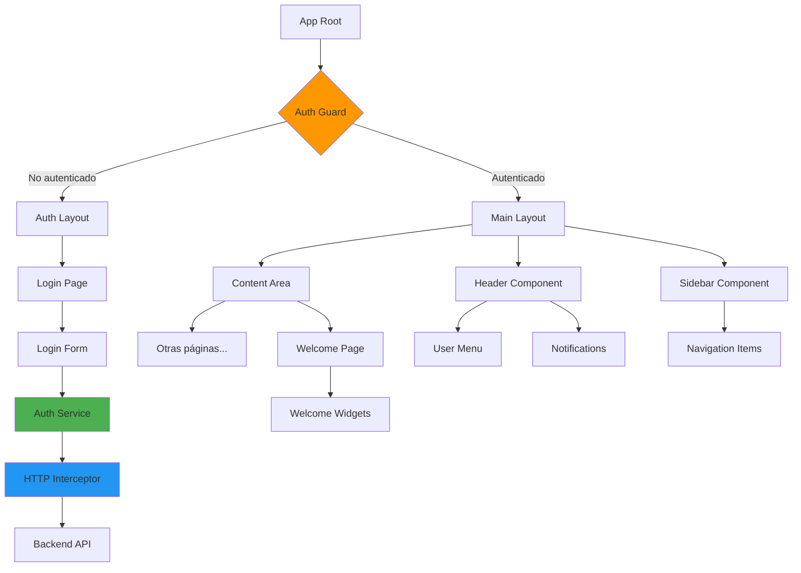
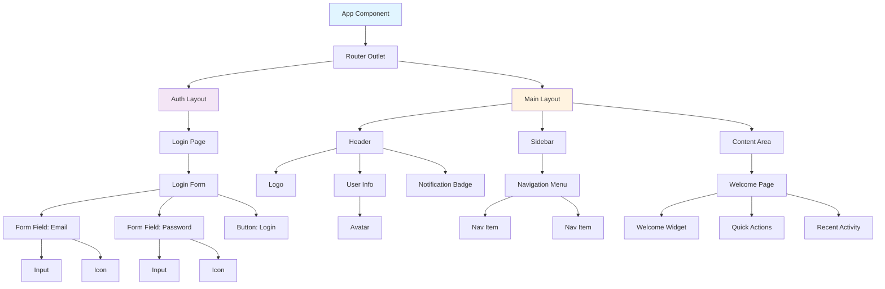
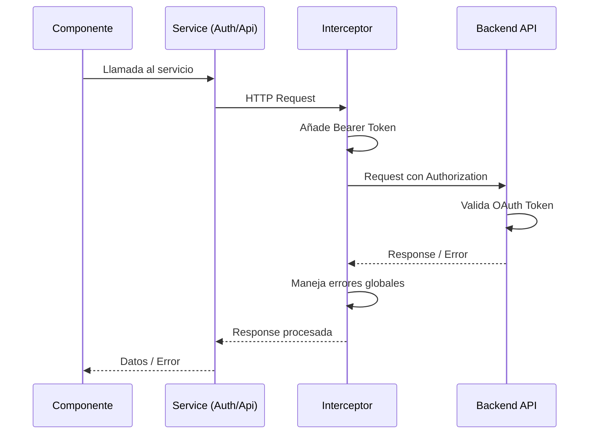

# Diseño Técnico: Portal Base PadelMixer

**Documento de Diseño Técnico v1.0**  
**Fecha:** 16/01/2026  
**Arquitecto:** Sistema de Diseño Angular - Web Components  
**Basado en:** `doc/funcional/portal-base.md`

---

## 1. Resumen Ejecutivo

Este documento describe el diseño técnico de la implementación del portal base de PadelMixer, incluyendo el sistema de autenticación, la estructura de layout principal y la navegación básica.

### 1.1. Alcance del Diseño

**Funcionalidades a implementar:**
- ✅ Sistema de autenticación con OAuth 2.0
- ✅ Layout principal con tres zonas (cabecera, menú lateral, contenido)
- ✅ Pantalla de login
- ✅ Pantalla de bienvenida (dashboard inicial)
- ✅ Capa de servicios para comunicación con backend
- ✅ Guards de rutas para protección de acceso
- ✅ Navegación básica

**Backend:**
- API REST securizada con OAuth 2.0
- Base URL: `http://URL_BACKEND/api`
- Endpoints protegidos que requieren token de autorización

---

## 2. Arquitectura de Componentes

### 2.1. Diagrama de Arquitectura General



### 2.2. Jerarquía de Componentes Web

Siguiendo el principio de **"todo es un componente web"**, la arquitectura se basa en composición:



---

## 3. Estructura de Directorios Completa

```
src/app/
├── core/                                    # Servicios singleton y configuración
│   ├── models/
│   │   ├── user.model.ts
│   │   ├── auth-response.model.ts
│   │   ├── navigation-item.model.ts
│   │   └── index.ts
│   ├── services/
│   │   ├── auth.service.ts
│   │   ├── api.service.ts
│   │   ├── storage.service.ts
│   │   └── navigation.service.ts
│   ├── guards/
│   │   ├── auth.guard.ts
│   │   └── no-auth.guard.ts
│   ├── interceptors/
│   │   ├── auth.interceptor.ts
│   │   └── error.interceptor.ts
│   └── config/
│       └── api.config.ts
│
├── shared/                                  # Componentes reutilizables
│   ├── components/
│   │   ├── atoms/
│   │   │   ├── button/
│   │   │   ├── input/
│   │   │   ├── icon/
│   │   │   └── avatar/
│   │   ├── molecules/
│   │   │   ├── form-field/
│   │   │   ├── user-info/
│   │   │   └── notification-badge/
│   │   └── organisms/
│   │       ├── header/
│   │       ├── sidebar/
│   │       └── navigation-menu/
│   └── directives/
│       └── auto-focus.directive.ts
│
├── layouts/
│   ├── auth-layout/
│   └── main-layout/
│
├── features/
│   ├── auth/
│   │   ├── components/
│   │   │   └── login-form/
│   │   ├── pages/
│   │   │   └── login/
│   │   └── auth.routes.ts
│   └── dashboard/
│       ├── components/
│       │   ├── welcome-widget/
│       │   ├── quick-actions/
│       │   └── recent-activity/
│       ├── pages/
│       │   └── welcome/
│       └── dashboard.routes.ts
│
├── app.component.ts
├── app.component.html
├── app.component.css
├── app.config.ts
└── app.routes.ts
```

---

## 4. Capa de Servicios (Intermediaria con Backend)

### 4.1. Diagrama de Flujo de Datos



### 4.2. Servicios Principales

#### AuthService
- **Ubicación:** `src/app/core/services/auth.service.ts`
- **Responsabilidad:** Gestión completa de autenticación OAuth 2.0
- **Métodos clave:**
  - `login(credentials)`: Autenticación con email/password
  - `logout()`: Cierre de sesión
  - `getToken()`: Obtener token actual
  - `refreshToken()`: Renovar token expirado
  - `isAuthenticated()`: Estado de autenticación (Signal)

#### ApiService
- **Ubicación:** `src/app/core/services/api.service.ts`
- **Responsabilidad:** Servicio base para todas las llamadas HTTP
- **Métodos:**
  - `get<T>(endpoint, options?)`
  - `post<T>(endpoint, body, options?)`
  - `put<T>(endpoint, body, options?)`
  - `patch<T>(endpoint, body, options?)`
  - `delete<T>(endpoint, options?)`

#### StorageService
- **Ubicación:** `src/app/core/services/storage.service.ts`
- **Responsabilidad:** Abstracción de localStorage
- **Métodos:**
  - `setItem(key, value)`
  - `getItem(key)`
  - `removeItem(key)`
  - `clear()`

#### NavigationService
- **Ubicación:** `src/app/core/services/navigation.service.ts`
- **Responsabilidad:** Gestión de items del menú de navegación
- **Métodos:**
  - `getNavigationItems()`: Items del menú
  - `getNavigationItemsByRole(roles)`: Filtrado por roles

---

## 5. Interceptores HTTP

### 5.1. AuthInterceptor

**Propósito:** Añadir automáticamente el token Bearer a todas las peticiones HTTP

**Ubicación:** `src/app/core/interceptors/auth.interceptor.ts`

**Comportamiento:**
1. Intercepta cada petición HTTP saliente
2. Obtiene token del `AuthService`
3. Si existe token y no es petición a `/auth/login`, añade header:
   ```
   Authorization: Bearer {token}
   ```
4. Permite que la petición continúe

### 5.2. ErrorInterceptor

**Propósito:** Manejo centralizado de errores HTTP

**Ubicación:** `src/app/core/interceptors/error.interceptor.ts`

**Manejo de errores:**
- **401 Unauthorized**: Cierra sesión automáticamente y redirige a login
- **403 Forbidden**: Muestra mensaje de permisos insuficientes
- **404 Not Found**: Recurso no encontrado
- **500 Server Error**: Error interno del servidor
- **Otros**: Mensaje genérico de error

---

## 6. Guards de Rutas

### 6.1. AuthGuard

**Propósito:** Proteger rutas que requieren autenticación

**Ubicación:** `src/app/core/guards/auth.guard.ts`

**Lógica:**
```typescript
if (usuario autenticado) {
  return true; // Permite acceso
} else {
  redirect a /auth/login;
  return false; // Bloquea acceso
}
```

**Uso en rutas:**
```typescript
{
  path: 'dashboard',
  canActivate: [authGuard],
  loadChildren: () => import('./features/dashboard/dashboard.routes')
}
```

### 6.2. NoAuthGuard

**Propósito:** Proteger rutas públicas (evitar acceso si ya está autenticado)

**Ubicación:** `src/app/core/guards/no-auth.guard.ts`

**Lógica:**
```typescript
if (usuario NO autenticado) {
  return true; // Permite acceso a login
} else {
  redirect a /dashboard;
  return false; // Ya está autenticado, no necesita login
}
```

---

## 7. Modelos de Datos

### 7.1. User

```typescript
export interface User {
  id: string;
  email: string;
  nombre: string;
  apellido: string;
  avatar?: string;
  roles: string[];
  fechaCreacion: Date;
  ultimoAcceso?: Date;
}
```

### 7.2. AuthResponse

```typescript
export interface AuthResponse {
  accessToken: string;
  refreshToken?: string;
  tokenType: string;  // "Bearer"
  expiresIn: number;  // segundos
  user: User;
}

export interface LoginCredentials {
  email: string;
  password: string;
  rememberMe?: boolean;
}
```

### 7.3. NavigationItem

```typescript
export interface NavigationItem {
  id: string;
  label: string;
  icon: string;
  route: string;
  order: number;
  requiredRoles?: string[];
  badge?: number;  // Para mostrar contador
  children?: NavigationItem[];
}
```

---

## 8. Configuración de Rutas

### 8.1. app.routes.ts (Principal)

**Archivo:** `src/app/app.routes.ts`

Configuración principal del sistema de rutas de Angular con lazy loading y guards.

### 8.2. Estructura de Rutas

```
/ (root)
├── '' → redirect '/dashboard'
├── auth/
│   ├── login
│   └── [futuro: registro, recuperar-password]
├── dashboard/ (protected)
│   └── '' → Welcome Page
├── jugadores/ (protected)
│   └── [futuro]
├── partidos/ (protected)
│   └── [futuro]
├── rankings/ (protected)
│   └── [futuro]
├── reservas/ (protected)
│   └── [futuro]
└── perfil/ (protected)
    └── [futuro]
```

### 8.3. Estrategia de Carga

- **Lazy Loading**: Todos los módulos de features se cargan bajo demanda
- **Guards**: Aplicados a nivel de ruta padre
- **Layouts**: Cada grupo de rutas usa su layout correspondiente

---

## 9. Layouts

### 9.1. AuthLayout

**Propósito:** Layout minimalista para páginas de autenticación

**Ubicación:** `src/app/layouts/auth-layout/`

**Estructura:**
```html
<div class="auth-layout">
  <div class="auth-layout__content">
    <div class="auth-layout__logo">
      <!-- Logo PadelMixer -->
    </div>
    <router-outlet></router-outlet>
  </div>
</div>
```

**Características:**
- Centrado en pantalla
- Sin navegación ni cabecera
- Fondo personalizado
- Responsive

### 9.2. MainLayout

**Propósito:** Layout principal con las 3 zonas (cabecera, sidebar, contenido)

**Ubicación:** `src/app/layouts/main-layout/`

**Estructura:**
```html
<div class="main-layout">
  <app-header class="main-layout__header"></app-header>
  
  <div class="main-layout__body">
    <app-sidebar class="main-layout__sidebar"></app-sidebar>
    
    <main class="main-layout__content">
      <router-outlet></router-outlet>
    </main>
  </div>
</div>
```

**CSS Grid Layout:**
```css
.main-layout {
  display: grid;
  grid-template-rows: 60px 1fr;
  grid-template-columns: 250px 1fr;
  height: 100vh;
}

.main-layout__header {
  grid-row: 1;
  grid-column: 1 / -1;
}

.main-layout__sidebar {
  grid-row: 2;
  grid-column: 1;
}

.main-layout__content {
  grid-row: 2;
  grid-column: 2;
  overflow-y: auto;
}
```

---

## 10. Componentes Clave

### 10.1. Header Component

**Tipo:** Organism  
**Ubicación:** `src/app/shared/components/organisms/header/`

**Responsabilidad:**
- Mostrar logo del portal
- Mostrar información del usuario actual
- Badge de notificaciones
- Menú desplegable con opciones (Mi Perfil, Configuración, Cerrar Sesión)

**Props (Inputs):**
- Ninguno (usa
