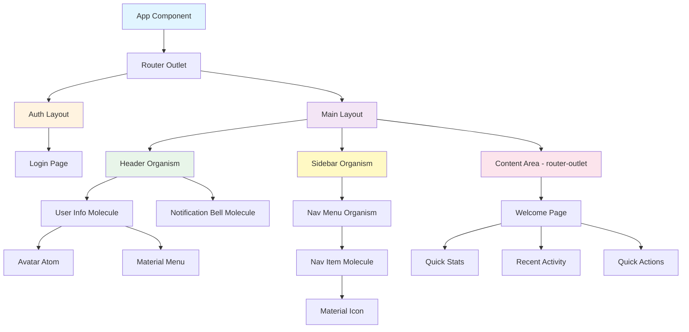

# Diseño Técnico: Portal Base PadelMixer

**Versión**: 1.0  
**Fecha**: 16/01/2026  
**Estado**: Diseño Inicial  
**Proyecto**: PadelMixer  
**Arquitecto**: Arquitecto Frontend Angular - Especialista en Web Components

---

## Tabla de Contenidos

1. [Resumen Ejecutivo](#1-resumen-ejecutivo)
2. [Arquitectura de Componentes](#2-arquitectura-de-componentes)
3. [Estructura de Directorios](#3-estructura-de-directorios)
4. [Componentes Detallados](#4-componentes-detallados)
5. [Servicios y Capa de Backend](#5-servicios-y-capa-de-backend)
6. [Modelos de Datos](#6-modelos-de-datos)
7. [Configuración de Rutas](#7-configuración-de-rutas)
8. [Guards y Seguridad](#8-guards-y-seguridad)
9. [Interceptores HTTP](#9-interceptores-http)
10. [Mocks y Desarrollo](#10-mocks-y-desarrollo)
11. [Flujos de Usuario](#11-flujos-de-usuario)
12. [Estilos y Temas](#12-estilos-y-temas)
13. [Testing Strategy](#13-testing-strategy)
14. [Checklist de Implementación](#14-checklist-de-implementación)

---

## 1. Resumen Ejecutivo

### 1.1. Propósito del Documento
Este documento define la arquitectura técnica del **Portal Base de PadelMixer**, estableciendo la estructura fundamental de componentes, servicios, rutas y modelos de datos que servirán como base para todas las funcionalidades futuras del portal.

### 1.2. Alcance del Diseño
- ✅ **Layout Principal**: Estructura con Header, Sidebar y Content Area
- ✅ **Sistema de Autenticación**: Guards, interceptores y gestión de sesiones
- ✅ **Pantallas Core**: Login y Dashboard de Bienvenida
- ✅ **Servicios Base**: Con arquitectura de mocks para desarrollo independiente
- ✅ **Configuración de Rutas**: Con lazy loading y protección
- ✅ **Modelos de Datos**: Interfaces TypeScript fuertemente tipadas
- ✅ **Integración Angular Material**: Sistema de componentes UI consistente

### 1.3. Stack Tecnológico
- **Framework**: Angular 17+ (Standalone Components)
- **Lenguaje**: TypeScript 5+
- **UI Library**: Angular Material 17+
- **Estado**: Angular Signals API
- **Routing**: Angular Router con lazy loading
- **HTTP**: HttpClient con interceptores
- **Autenticación**: JWT-based con localStorage
- **Testing**: Jasmine + Karma

### 1.4. Principios de Diseño Aplicados
1. **Component-Based Architecture**: Todo es un componente web reutilizable
2. **Atomic Design**: Organización jerárquica (Atoms → Molecules → Organisms → Templates → Pages)
3. **Separation of Concerns**: Clara separación entre presentación, lógica y datos
4. **Material Design First**: Priorizar componentes de Angular Material antes que custom
5. **Mock-Driven Development**: Desarrollo independiente del backend mediante sistema de mocks

---

## 2. Arquitectura de Componentes

### 2.1. Diagrama de Arquitectura General



### 2.2. Jerarquía Atomic Design

#### **Atoms (Átomos)**
Componentes básicos, principalmente de Angular Material:
- `mat-button` - Botones de acción
- `mat-icon` - Iconos Material
- `mat-form-field` - Campos de formulario
- `mat-input` - Inputs de texto
- `mat-badge` - Indicadores numéricos
- `Avatar` (custom) - Avatar circular de usuario

#### **Molecules (Moléculas)**
Combinaciones funcionales de átomos:
- `UserInfo` - Avatar + nombre + menú desplegable
- `NotificationBell` - Icono + badge + menú de notificaciones
- `NavItem` - Icono + texto + estado activo + ripple effect
- `DashboardCard` - Card Material con contenido específico

#### **Organisms (Organismos)**
Componentes complejos con lógica:
- `Header` - Cabecera principal fija
- `Sidebar` - Menú lateral de navegación
- `NavMenu` - Lista completa de navegación con items

#### **Templates (Plantillas)**
Layouts estructurales:
- `MainLayout` - Layout principal (Header + Sidebar + Content)
- `AuthLayout` - Layout para autenticación (centrado, sin header/sidebar)

#### **Pages (Páginas)**
Vistas completas con datos:
- `LoginPage` - Pantalla de autenticación
- `WelcomePage` - Dashboard de bienvenida

---

## 3. Estructura de Directorios

```
src/app/
│
├── core/                                    # Servicios singleton y lógica central
│   ├── config/
│   │   └── app.config.ts                   # Configuración global de la app
│   │
│   ├── guards/
│   │   ├── auth.guard.ts                   # Guard para rutas protegidas
│   │   └── no-auth.guard.ts                # Guard para rutas públicas (ej: login)
│   │
│   ├── interceptors/
│   │   ├── auth.interceptor.ts             # Inyección automática de JWT token
│   │   ├── error.interceptor.ts            # Manejo global de errores HTTP
│   │   └── mock.interceptor.ts             # Interceptor para simular backend con mocks
│   │
│   ├── models/
│   │   ├── user.model.ts                   # Interfaces: User, UserProfile, UserRole, etc.
│   │   ├── auth.model.ts                   # Interfaces: LoginCredentials, AuthResponse, etc.
│   │   ├── notification.model.ts           # Interfaces: Notification, NotificationType
│   │   └── nav-item.model.ts               # Interface: NavMenuItem
│   │
│   ├── services/
│   │   ├── auth.service.ts                 # Servicio de autenticación y sesión
│   │   ├── user.service.ts                 # Servicio de gestión de usuarios
│   │   └── notification.service.ts         # Servicio de notificaciones
│   │
│   └── mocks/
│       ├── auth.mock.ts                    # Datos mock para autenticación
│       ├── user.mock.ts                    # Datos mock de usuarios
│       └── notification.mock.ts            # Datos mock de notificaciones
│
├── shared/                                  # Componentes reutilizables
│   ├── components/
│   │   ├── atoms/
│   │   │   └── avatar/
│   │   │       ├── avatar.component.ts
│   │   │       ├── avatar.component.html
│   │   │       └── avatar.component.css
│   │   │
│   │   ├── molecules/
│   │   │   ├── user-info/
│   │   │   │   ├── user-info.component.ts
│   │   │   │   ├── user-info.component.html
│   │   │   │   └── user-info.component.css
│   │   │   │
│   │   │   ├── notification-bell/
│   │   │   │   ├── notification-bell.component.ts
│   │   │   │   ├── notification-bell.component.html
│   │   │   │   └── notification-bell.component.css
│   │   │   │
│   │   │   ├── nav-item/
│   │   │   │   ├── nav-item.component.ts
│   │   │   │   ├── nav-item.component.html
│   │   │   │   └── nav-item.component.css
│   │   │   │
│   │   │   └── dashboard-card/
│   │   │       ├── dashboard-card.component.ts
│   │   │       ├── dashboard-card.component.html
│   │   │       └── dashboard-card.component.css
│   │   │
│   │   └── organisms/
│   │       ├── header/
│   │       │   ├── header.component.ts
│   │       │   ├── header.component.html
│   │       │   └── header.component.css
│   │       │
│   │       ├── sidebar/
│   │       │   ├── sidebar.component.ts
│   │       │   ├── sidebar.component.html
│   │       │   └── sidebar.component.css
│   │       │
│   │       └── nav-menu/
│   │           ├── nav-menu.component.ts
│   │           ├── nav-menu.component.html
│   │           └── nav-menu.component.css
│   │
│   ├── directives/
│   ├── pipes/
│   └── utils/
│
├── layouts/                                 # Layouts de la aplicación
│   ├── main-layout/
│   │   ├── main-layout.component.ts
│   │   ├── main-layout.component.html
│   │   └── main-layout.component.css
│   │
│   └── auth-layout/
│       ├── auth-layout.component.ts
│       ├── auth-layout.component.html
│       └── auth-layout.component.css
│
├── features/                                # Módulos por funcionalidad
│   ├── auth/
│   │   ├── components/
│   │   │   └── login-form/
│   │   │       ├── login-form.component.ts
│   │   │       ├── login-form.component.html
│   │   │       └── login-form.component.css
│   │   │
│   │   ├── pages/
│   │   │   └── login/
│   │   │       ├── login.component.ts
│   │   │       ├── login.component.html
│   │   │       └── login.component.css
│   │   │
│   │   └── auth.routes.ts
│   │
│   └── dashboard/
│       ├── components/
│       │   ├── quick-stats/
│       │   ├── recent-activity/
│       │   └── quick-actions/
│       │
│       ├── pages/
│       │   └── welcome/
│       │       ├── welcome.component.ts
│       │       ├── welcome.component.html
│       │       └── welcome.component.css
│       │
│       └── dashboard.routes.ts
│
├── app.routes.ts                            # Configuración principal de rutas
├── app.config.ts                            # Configuración de la aplicación
├── app.ts                                   # Componente raíz
└── app.html                                 # Template raíz
```

---

## 4. Componentes Detallados

### 4.1. Tabla Resumen de Componentes

| Componente | Tipo | Responsabilidad | Reutilizable | Ubicación | Deps Material |
|------------|------|-----------------|--------------|-----------|---------------|
| Avatar | Atom | Avatar circular usuario | Sí | `shared/components/atoms/avatar/` | mat-icon |
| UserInfo | Molecule | Info usuario + menú | Sí | `shared/components/molecules/user-info/` | mat-menu, mat-icon, mat-button |
| NotificationBell | Molecule | Notificaciones con badge | Sí | `shared/components/molecules/notification-bell/` | mat-badge, mat-menu, mat-icon |
| NavItem | Molecule | Item navegación | Sí | `shared/components/molecules/nav-item/` | mat-icon, mat-ripple |
| DashboardCard | Molecule | Tarjeta dashboard | Sí | `shared/components/molecules/dashboard-card/` | mat-card |
| Header | Organism | Cabecera principal | Sí | `shared/components/organisms/header/` | mat-toolbar |
| Sidebar | Organism | Menú lateral | Sí | `shared/components/organisms/sidebar/` | mat-sidenav |
| NavMenu | Organism | Menú de navegación | Sí | `shared/components/organisms/nav-menu/` | mat-nav-list |
| MainLayout | Template | Layout principal | Sí | `layouts/main-layout/` | mat-sidenav-container |
| AuthLayout | Template | Layout autenticación | Sí | `layouts/auth-layout/` | - |
| LoginForm | Component | Formulario login | No | `features/auth/components/login-form/` | mat-form-field, mat-input, mat-button |
| LoginPage | Page | Página login | No | `features/auth/pages/login/` | - |
| WelcomePage | Page | Dashboard bienvenida | No | `features/dashboard/pages/welcome/` | mat-grid-list |

### 4.2. Header Component (Organism)

**Responsabilidad**: Cabecera fija en la parte superior con logo, notificaciones e información del usuario.

**Props/Inputs**: Ninguno (consume servicios directamente)

**Events/Outputs**: Ninguno (gestiona navegación internamente)

**Código TypeScript**:
```typescript
import { Component, inject } from '@angular/core';
import { CommonModule } from '@angular/common';
import { Router } from '@angular/router';
import { MatToolbarModule } from '@angular/material/toolbar';
import { MatIconModule } from '@angular/material/icon';
import { MatButtonModule } from '@angular/material/button';

import { UserInfoComponent } from '../../molecules/user-info/user-info.component';
import { NotificationBellComponent } from '../../molecules/notification-bell/notification-bell.component';
import { AuthService } from '../../../core/services/auth.service';
import { NotificationService } from '../../../core/services/notification.service';

@Component({
  selector: 'app-header',
  standalone: true,
  imports: [
    CommonModule,
    MatToolbarModule,
    MatIconModule,
    MatButtonModule,
    UserInfoComponent,
    Notification
